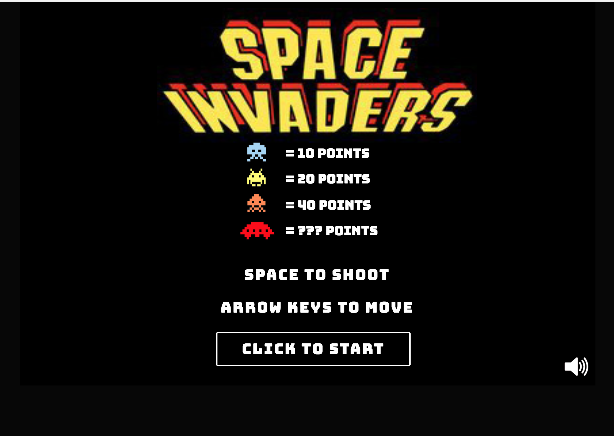

### Space Invaders

Este proyecto es una implementación del clásico juego Space Invaders usando HTML5 Canvas y JavaScript. El objetivo del juego es destruir todos los aliens antes de que lleguen a la parte inferior de la pantalla. Los movimientos de la nave y los aliens están basados en funciones de tiempo, simulando movimientos en un plano cartesiano según los conceptos de Cálculo 1.

[Click here to Play Space Invaders](https://arianesomoza.github.io/DestroyXY/)

